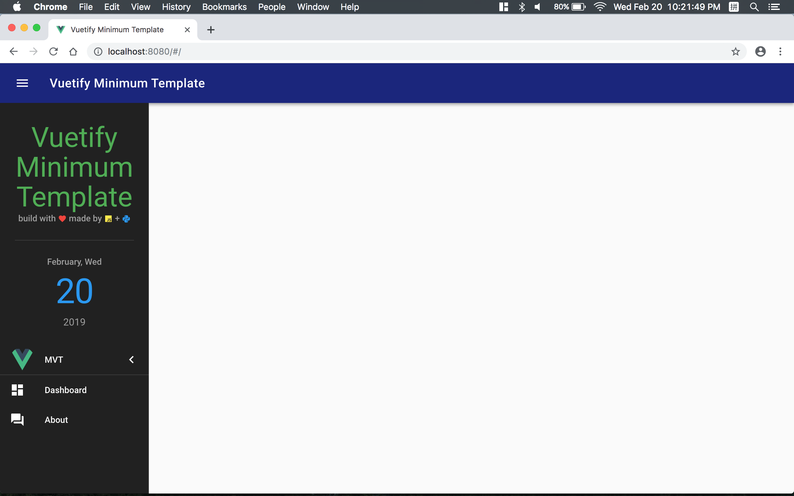

# Vuetify-Minimum-Template
Try the awesome Material Style Component framework **Vuetify**(http://www.github.com/vuetifyjs/vuetify)! Start the bootstrap with `Vuex` and `Vue-router`.

### Screenshot


### Project setup
install necessary packages
```
yarn install
```
run in test mode
```
yarn run dev
```
